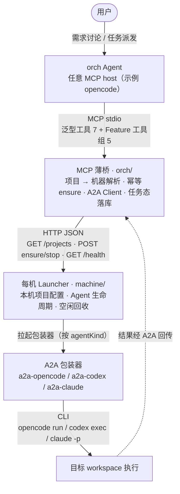

# a2a-coding

> 基于 A2A 的分布式 Code Agent 协作：以 orch Agent 为统一入口，按「项目」组织 Code Agent，三端均支持（OpenCode / Codex / Claude Code），让需求讨论留在 orch、执行交给各项目自己的 Agent。

<!-- badges 待补充：仓库暂无 LICENSE 文件、无 CI 状态、无发布版本，可在此补充 License / Build Status / Version 徽章 -->

## 目录

- [简介](#简介)
- [功能特性](#功能特性)
- [演示 / 截图](#演示--截图)
- [技术栈](#技术栈)
- [快速开始](#快速开始)
  - [环境要求](#环境要求)
  - [安装](#安装)
  - [配置](#配置)
  - [运行](#运行)
- [使用示例](#使用示例)
- [配置说明](#配置说明)
- [API 文档](#api-文档)
- [目录结构](#目录结构)
- [开发](#开发)
- [测试](#测试)
- [构建与部署](#构建与部署)
- [常见问题](#常见问题)
- [贡献指南](#贡献指南)
- [许可证](#许可证)
- [致谢](#致谢)

## 简介

a2a-coding 让开发协作时 orch 只管派发任务；目标项目的执行 Agent 按需拉起，在对应 workspace 实际执行，结果回传 orch，用完退出但会话可继承。架构不依赖「必须跨机器」：同一台机器上跑 orch 与 Launcher 同样成立，链路只是简化为本机调用。

架构为三段式：orch 侧的 MCP 薄桥只做「项目 → 机器」解析与转发；每台执行机器常驻一个 Launcher，负责本机项目 Agent 的生命周期；Launcher 拉起 A2A 包装器，包装器再驱动底层 CLI。跨机通信走 A2A，orch 的工具面走 MCP，全程无中心注册。三端均已完成真实模型端到端验证（拉起 → 派发 → 执行 → 回传，退出后携带同一 `contextId` 续接）。



- 静态分布：项目到机器的映射来自配置，没有自注册、心跳、TTL 或服务发现。
- 按需幂等：派发任务才 `ensure`，已在运行直接复用端点。
- 用完退出：项目 Agent 空闲超时自动回收，会话靠 `contextId` 续接。

### 部署形态

「机器」是一个逻辑单位，可以是远端主机，也可以是本机；「项目 → 机器」的映射全部来自静态配置，因此同一套架构天然支持以下形态：

| 形态 | 说明 |
|------|------|
| 跨机跨环境 | orch 在一台机器上讨论，执行 Agent 在另一台机器上运行（例：Windows 的 orch + Mac 上的执行 Agent），跨机通信走 A2A。 |
| 同机多项目 | 同一台机器上一份 Launcher 管理多个项目，各项目独立 `workspace` 与 A2A 端口，前后端 / 多项目并行协作。 |
| 多角色 | 同一项目或不同项目分别绑定开发 / 审查 / 测试 Agent，按任务选择派发目标。 |

同机即「机器 = 本机」：项目照样解析到本机的 Launcher，只是链路从跨机 A2A 简化为本机调用，架构与跨机完全一致。反向代理带来的网络可达性、认证与安全边界等额外注意事项只在跨机时出现，详见「常见问题」。

相关文档：

- [PROTOCOL.md](PROTOCOL.md)：Bridge ⇄ Launcher 线协议契约（端点 / 字段、版本规则、握手语义、可支持对端版本维护流程、演进记录表）。
- [CHANGELOG.md](CHANGELOG.md)：版本变更记录。

## 功能特性

- ✅ **三端执行 Agent**：包装器按 `agentKind` 分派 `opencode` / `codex` / `claude`，驱动底层 CLI（`opencode run` / `codex exec` / `claude -p`）。
- ✅ **静态分布，无中心注册**：项目到机器的映射来自配置，不做自注册、心跳、TTL 或服务发现。
- ✅ **每机常驻 Launcher**：管理本机项目 Agent 生命周期，暴露 `health` / `projects` / `ensure` / `stop` 接口。
- ✅ **按需幂等启动**：派发任务才 `ensure`，已在运行直接复用同一 A2A 端点，不重复拉起。
- ✅ **泛型 MCP 工具面**：orch 只经 `a2a_projects` / `a2a_call` / `a2a_task_status` / `a2a_tasks` / `a2a_cancel` / `a2a_events` / `a2a_wait` 通信，agent 增减无需重连或刷新工具面。
- ✅ **Feature 编排**：把一个需求作为 Feature，经状态机 + 拓扑并行 Task DAG 调度器跨项目自动派发，中途可停下审批 / 澄清；上游失败向下游传播 `blocked`，不带病继续。
- ✅ **会话映射持久化**：`contextId ↔ sessionId` 落 SQLite（`node:sqlite`），两侧进程重启均不丢。
- ✅ **任务态回传与兜底找回**：任务态与结果落库；丢失 `taskId` 句柄可用 `a2a_tasks` 找回。
- ✅ **最小权限**：项目 `risk` 档位（`read` / `write` / `full`）映射到各端权限 / 沙箱参数。
- ✅ **跨平台后台启停**：`launcherctl.mjs` 在 Windows / Linux / macOS 统一 start / stop / restart / status / logs。
- ✅ **线协议版本化握手**：桥首触一台机器先握手校验主版本，不兼容即拒绝派发并给出升级指引。
- ✅ **启动自检与空闲回收**：Launcher 启动时对全部项目跑真实最小任务自检；项目 Agent 空闲超时自动回收。

## 演示 / 截图

暂无。本项目以 CLI / MCP 与常驻服务为主，没有可视化界面，仓库暂未提供演示视频或截图。

## 技术栈

| 层 | 技术 |
|----|------|
| MCP 桥（orch 工具面） | Node.js + TypeScript，官方 `@a2a-js/sdk`（A2A Client）+ `@modelcontextprotocol/sdk` + zod |
| 每机启动器（Launcher） | Node.js + TypeScript + express，常驻各机，管理本机项目 Agent 生命周期 |
| 执行层包装 | `a2a-wrapper`（`a2a-opencode` / `a2a-codex` / `a2a-claude`，按 `agentKind` 分派） |
| 会话 / 任务存储 | `node:sqlite`（SQLite，桥侧持久化 sessions + tasks + features） |
| 会话落盘补丁 | `patch-package`（`postinstall` 自动应用三端 wrapper 补丁） |
| 协议 | A2A（协议 1.0，跨 Agent 通信）；Bridge ⇄ Launcher 走 HTTP 线协议 |
| 运行时 | Node.js ≥ 22.5（使用内置 `node:sqlite`）、TypeScript、ESM |

## 快速开始

### 环境要求

- Node.js ≥ 22.5（会话 / 任务库用内置 `node:sqlite`）。
- **orch agent 与 `orch/`（MCP 桥）必须同机**：桥是本地 stdio MCP server，由 orch agent 作为子进程拉起。执行机器（Launcher + 项目 Agent）可在本机或远端。
- 执行机器按项目 `agentKind` 准备对应的 CLI 与认证（Launcher 从自身进程环境继承）：
  - `opencode`：PATH 上有 `opencode` CLI（三端中**唯一**需要预装 CLI 的 kind）；Launcher 会先拉起 `opencode serve` 作为前置后端。
  - `codex`：**无需在 PATH 安装全局 `codex` CLI**，`a2a-codex` 依赖已内置 codex 运行时（`@openai/codex` + 对应平台包，`npm install` 按 OS/arch 自动选择，SDK 自动解析）；仅需认证（`OPENAI_API_KEY`，或 `codex login` 生成的 `~/.codex/auth.json`），无前置后端。自定义网关经 `~/.codex/config.toml` 的 `[model_providers.*]` 配置：`base_url` 须为 OpenAI 兼容地址，注意 codex 会在其后拼接 `/responses`（`wire_api = "responses"`），网关地址需含版本段（如 `https://…/v1`）。如需指定其它 codex 版本 / 二进制，可用 `agentConfig.codex.codexPathOverride`。
  - `claude`：**无需在 PATH 安装全局 `claude` CLI**，`a2a-claude` 依赖已内置 Claude Code 运行时（`@anthropic-ai/claude-agent-sdk` + 对应平台包，`npm install` 按 OS/arch 自动选择）。默认**加载用户级配置**（`settingSources: ["user"]`，读取 `~/.claude/settings.json` 的模型 / 网关 / 认证 `env`），交互式 Claude Code 已配好的用户开箱即用。项目可显式覆盖：`agentConfig.claude.settingSources: []` 恢复完全隔离（此时需把 `ANTHROPIC_API_KEY` / `ANTHROPIC_BASE_URL` 注入 **Launcher 进程环境**）；模型可写在该项目 `agentConfig.claude.model`（优先于用户配置）。如需指定其它 Claude Code 版本 / 二进制，可用 `agentConfig.claude.executablePathOverride`。
- codex 项目的 `workspace` 默认只需指向一个目录，不必是 Git 仓库（Launcher 默认注入 `codex.skipGitRepoCheck: true`）；若要强制 Git 校验，可在该项目的 `agentConfig.codex` 里覆盖为 `false`。
- orch（**任意支持本地 stdio MCP 的 agent**，如 opencode / Claude Code / Codex / Cursor）与执行机器的 CLI 都已配好模型 provider，否则无法调用模型。
- Windows / macOS 均可，单元内的 CLI 参数已做跨平台处理。

### 安装

先克隆仓库，再分别安装两个部署单元（`orch/` 与 `machine/` 各自自包含，各自 `npm install`）：

```bash
git clone <仓库地址>
cd a2a-coding

# 执行机器：Launcher
cd machine
npm install          # postinstall 自动执行 patch-package，应用会话落盘补丁

# orch 机器：MCP 桥
cd ../orch
npm install
npm run build        # 产出 dist/bridge/index.js
```

### 配置

两个单元各有一份 `config/config.json`，实际配置不入库，首次部署从 `config/config.json.default` 复制并填入真实值：

- 执行机器：`machine/config/config.json`，声明 `machineId`、`launcher` 与 `projects[]`。
- orch 机器：`orch/config/config.json`，声明 `machines[]`（每项 `machineId` + `launcherUrl`）。

字段说明见 [配置说明](#配置说明) 与各单元 `config/config.json.default`。

把 MCP 桥配进 orch agent。把下面这段加入 orch 宿主的 MCP 配置后重启 orch；下例为 opencode 的 `opencode.json`，**任何支持本地 stdio MCP 的 agent**（Claude Code、Codex、Cursor 等）同理，仅配置位置与格式不同：

```json
{
  "$schema": "https://opencode.ai/config.json",
  "mcp": {
    "a2a": {
      "type": "local",
      "command": ["node", "G:/code/a2a-coding/orch/dist/bridge/index.js"],
      "environment": {
        "MACHINES_CONFIG": "G:/code/a2a-coding/orch/config/config.json",
        "SESSION_DB": "G:/code/a2a-coding/orch/data/sessions.sqlite"
      },
      "enabled": true
    }
  }
}
```

把 `command` 的路径换成实际部署路径即可。`MACHINES_CONFIG` 与 `SESSION_DB` 缺省时分别回退到 orch 单元根的 `config/config.json` 与 `./data/sessions.sqlite`。若 orch 不是 opencode，按该 agent 的方式登记同一个 stdio MCP server（`command` 与环境变量一致）即可，桥本身不绑定任何宿主。仓库内 `orch/opencode.json` 是一份把 `mcp.a2a` 配进 orch 的样例。

> ⚠️ **同机约束**：桥（`orch/` 单元）是本地 stdio MCP server，由 orch agent 作为子进程拉起，因此**必须与 orch agent 部署在同一台机器**（当前不支持把桥放远端用 HTTP 连）。

### 运行

执行机器以后台常驻方式启动 Launcher（跨平台，日志写入 `machine/.a2a/logs/launcher.log`）：

```bash
cd machine
npm run start        # 后台启动（已在运行则提示并退出 0）
npm run status       # 查看 pid / host:port / health / startedAt
```

启动后，Launcher 会按配置监听端口并暴露本机项目；orch 侧即可通过 MCP 工具派发任务。首次落地时 Launcher 默认对全部项目跑一遍启动自检，自检通过才放行业务路由（详见 [构建与部署](#构建与部署)）。

前台调试可用 `npm run launcher`（先 `tsc` 构建，再运行 `dist/launcher/index.js`）；完整的启停 / 日志命令见 [构建与部署](#构建与部署)。

## 使用示例

工具面为「**泛型工具 7 + Feature 工具组 5**」，在 orch 里直接调用：

```text
a2a_projects()
a2a_call(project="machine", message="列出当前目录的顶层文件")
a2a_call(project="machine", message="把刚才的结果按类型分组", contextId="<上一轮返回的 contextId>")
```

`a2a_call` 省略 `contextId` 时自动新建并在返回中给出；续接同一上下文时把它带回来即可。

Feature 编排（把一个需求作为 Feature 推进）：

```text
# 1) orch 建 Feature，组织各项目分析、汇总方案
a2a_feature_create(title="给登录页加记住我", requirement="…")
# 2) 推进主链到等待审批后停下
a2a_feature_advance(featureId="<id>", to="waiting_approval")
# 3) 用户放行，桥内 Task DAG 调度器按 dependencies 拓扑派发（同层并行）
a2a_feature_approve(featureId="<id>")
# 4) 任务需澄清时 Feature 停 needs_input，补齐答案续推
a2a_feature_advance(featureId="<id>", to="executing", answer="…")
```

调度器为**代码组件**，LLM 不参与等待 / 轮询。

## 配置说明

### machine：`machine/config/config.json`

每台机器自维护本机项目（实际配置 `config/config.json` 不入库，首次部署从 `config/config.json.default` 复制并填入本机真实值）。

| 字段 | 说明 | 默认值 | 必填 |
|------|------|--------|------|
| `machineId` | 机器标识，需与 orch 机器清单一致 | - | 是 |
| `launcher.port` | Launcher 监听端口 | - | 是 |
| `launcher.idleStopMs` | 空闲回收时长（毫秒），项目 Agent 超过该时长没有 `ensure` 调用就自动 `stop`；`0` 或负值表示禁用 | `300000` | 否 |
| `launcher.startupCheck` | 启动自检开关，`false` 跳过自检直接进入服务 | `true` | 否 |
| `launcher.startupCheckTimeoutMs` | 每个项目自检的总超时（毫秒） | `120000` | 否 |
| `launcher.startupCheckPrompt` | 自检 prompt | `Reply with exactly: OK` | 否 |
| `launcher.listenHost` | Launcher 绑定地址；缺省不设置 = 绑定全部网卡。启用 `shutdownEndpoint` 时建议设为 `127.0.0.1` | 不设置 | 否 |
| `launcher.shutdownEndpoint` | `true` 时注册 `POST /shutdown`（仅接受 loopback 来源）。反代转发后源地址为 loopback，**Caddy / 反向代理必须 deny `/shutdown`** | `false` | 否 |
| `launcher.shutdownToken` | `POST /shutdown` 的 Bearer 令牌（`Authorization: Bearer <token>`） | 不校验 | 否 |
| `projects[]` | 本机项目列表 | - | 是 |
| `projects[].projectId` | 项目标识，全局唯一 | - | 是 |
| `projects[].workspace` | 执行目录 | - | 是 |
| `projects[].agentKind` | `opencode` / `codex` / `claude` | - | 是 |
| `projects[].a2aPort` | 该项目 A2A Server 监听端口 | - | 是 |
| `projects[].risk` | 项目风险档位，`read` / `write` / `full`，决定包装器传给底层 CLI 的权限 / 沙箱参数 | `write` | 否 |
| `projects[].agentConfig` | 包装器配置片段，顶层键如 `model` / `mcp` / `events` / `systemPrompt`；launcher 会与默认项 `{ "events": { "enabled": false } }` 深合并，写入 `agents/<agentKind>.<projectId>.json`，经 `--config` 传给包装器，再与包装器内置默认值深合并 | - | 否 |
| `projects[].agentConfig.agentCard.pushNotifications` | worker push 能力开关；`true` 时项目 Agent 可向 orch 回调端点推送状态变化（配合 orch `callback` + `pushCallback` 使用） | `false`（默认关） | 否 |

`risk` 到各端权限参数的映射（`write` 为默认，恰等于三端包装器内置默认；opencode 只有自动放行开 / 关一个旋钮，`write` 与 `full` 相同）：

| risk | opencode | codex（`--sandbox`） | claude（`--permission-mode`） |
|------|----------|----------------------|-------------------------------|
| `read` | `--no-auto-approve` | `read-only` | `plan` |
| `write`（默认） | `--auto-approve` | `workspace-write` | `acceptEdits` |
| `full` | `--auto-approve` | `danger-full-access` | `bypassPermissions` + 配置 `claude.dangerouslyAllowBypassPermissions=true` |

样例：

```json
{
  "machineId": "win-dev",
  "launcher": { "port": 3100, "idleStopMs": 300000 },
  "projects": [
    {
      "projectId": "machine",
      "workspace": "G:/code/a2a-coding/machine",
      "agentKind": "opencode",
      "a2aPort": 3010,
      "agentConfig": {
        "events": { "enabled": false }
      }
    }
  ]
}
```

环境变量 `MACHINE_CONFIG` 可指定其他配置文件；缺省为 `config/config.json`（模板 `config/config.json.default`）。

### orch：`orch/config/config.json`

orch 只持有「有哪些机器、Launcher 地址」，项目明细由各机自持（实际配置 `config/config.json` 不入库，首次部署从 `config/config.json.default` 复制并填入真实机器地址）。字段为 `machines[]`（每项含 `machineId` + `launcherUrl`）与可选的 `callback`。

| 字段 | 说明 | 默认值 | 必填 |
|------|------|--------|------|
| `machines[].machineId` | 机器标识，需与本机 Launcher 配置一致 | - | 是 |
| `machines[].launcherUrl` | 该机 Launcher 地址（如 `http://localhost:3100`） | - | 是 |
| `machines[].pushCallback` | 按机 opt-in：允许该机 worker 向 orch 回调端点推送状态变化（需配合 `callback` 与项目 `agentConfig.agentCard.pushNotifications`） | `false` | 否 |
| `callback.enabled` | 开启 orch HTTP 事件端点（`POST /callback`），接收 worker push；**默认关**，仅同机 / 受信网络 opt-in | `false` | 否 |
| `callback.host` | 事件端点绑定地址（建议 loopback） | `127.0.0.1` | 否 |
| `callback.port` | 事件端点监听端口 | - | `callback.enabled=true` 时是 |
| `callback.token` | 事件端点校验令牌（worker 推送时携带）；不填则不校验 | 不校验 | 否 |

```json
{
  "machines": [
    { "machineId": "win-dev", "launcherUrl": "http://localhost:3100", "pushCallback": false }
  ],
  "callback": { "enabled": false, "host": "127.0.0.1", "port": 3200, "token": "<可选>" }
}
```

> `callback` 默认关闭：跨机回调受鉴权边界约束（跨机鉴权待后续），当前仅同机 / 受信网络可 opt-in。关闭或端点不可达时，任务终态仍由 `task-watcher` 轮询对账兜底落库。

环境变量 `MACHINES_CONFIG` 可指定其他清单文件；缺省为 `config/config.json`（模板 `config/config.json.default`）。

### 同机多项目示例

同一台机器上跑两个项目时，只需在**一份** machine 配置里多写几个 `projects[]`，各自用不同 `workspace` 与 `a2aPort`：

`machine/config/config.json`：

```json
{
  "machineId": "local",
  "launcher": { "port": 3100, "idleStopMs": 300000 },
  "projects": [
    { "projectId": "frontend", "workspace": "/abs/path/to/frontend", "agentKind": "opencode", "a2aPort": 3010 },
    { "projectId": "backend",  "workspace": "/abs/path/to/backend",  "agentKind": "opencode", "a2aPort": 3011 }
  ]
}
```

`orch/config/config.json`（同机：只需一条机器项，指向本机 Launcher）：

```json
{ "machines": [ { "machineId": "local", "launcherUrl": "http://localhost:3100" } ] }
```

orch 用 `project`（如 `frontend` / `backend`）派发到对应项目。

### 桥的环境变量

| 变量 | 说明 | 默认值 | 必填 |
|------|------|--------|------|
| `MACHINES_CONFIG` | orch 机器清单文件路径 | `orch/config/config.json` | 否 |
| `SESSION_DB` | 会话 / 任务库 SQLite 路径 | `orch/data/sessions.sqlite` | 否 |
| `SYNC_BUDGET_MS` | `a2a_call` 同步等待预算（毫秒），超过即返回 `working + taskId` 转后台看护；**必须小于 orch agent 的 MCP 客户端请求超时**（`@modelcontextprotocol/sdk` 默认 60s，超时抛 -32001） | `30000` | 否 |

### Launcher 的环境变量

| 变量 | 说明 | 默认值 | 必填 |
|------|------|--------|------|
| `MACHINE_CONFIG` | machine 项目配置文件路径 | `machine/config/config.json` | 否 |

## API 文档

### Launcher HTTP 接口

Launcher 按 `machine/config/config.json` 监听（模板见 `machine/config/config.json.default`），暴露以下接口。同机部署时 orch 的 `launcherUrl` 指向 `http://localhost:<port>` 即可。

| 接口 | 作用 |
|------|------|
| `GET  /health` | 健康检查（自报线协议版本 `protocolVersion`） |
| `GET  /projects` | 本机项目清单 + 运行态 |
| `POST /projects/{projectId}/ensure` | 幂等启动，返回 A2A 端点 |
| `POST /projects/{projectId}/stop` | 停止项目 Agent |
| `POST /shutdown` | 优雅停止 Launcher（**可选**，`launcher.shutdownEndpoint=true` 时注册；仅接受 loopback 来源） |

Bridge ⇄ Launcher 的线协议以仓库根 [PROTOCOL.md](PROTOCOL.md) 为单一事实源（端点 / 字段、版本规则、握手语义、演进记录表）。

### MCP 工具面

#### 泛型工具（7 个）

- `a2a_projects()`：列出所有已配置机器及其本机项目（含运行态与 A2A 端点）。
- `a2a_call(project, message, contextId?, wait?)`：解析项目到机器，幂等 ensure，经 A2A 派发一轮任务。默认半异步：≤30s 完成直接返回文本结果与 artifacts，更长返回 `working + taskId` 并用 `a2a_task_status` 轮询；`wait=false` 时永远立即返回 `working + taskId + contextId`（不进入同步轮询，后台看护照常落库）。
- `a2a_task_status(taskId)`：查询任务态并回写本地任务存储。已终结任务（completed / failed / input-required）由桥本地存档直接作答（不唤醒远端 Agent）；未终结任务走远端实时查询。
- `a2a_tasks(project, [state], [limit])`：按项目列出本地任务记录（默认 `updatedAt` 倒序、默认 20 条、最多 100），每条含 `prompt` 片段 / state / text / contextId / updatedAt / stale。用于丢失 `taskId` 句柄后的兜底找回。
- `a2a_cancel(taskId)`：取消任务，并回写本地任务存储。
- `a2a_events(since?)`：读取事件收件箱增量（任务结算 / 阻塞、Feature 流转、worker push）。省略 `since` 则自进程读游标起；无变化时廉价空返回。
- `a2a_wait(timeoutMs?)`：长轮询等待新事件（推送优先唤醒 + 定时对账），最多 `timeoutMs`（内部上限低于同步预算）；超时无事件则 `timedOut=true`。

#### Feature 工具组（5 个）

把一个需求作为 Feature 编排：`a2a_feature_create` 建 Feature → orch 组织各项目分析、汇总方案 → `a2a_feature_advance` 推进到 `waiting_approval` 停下 → 用户 `a2a_feature_approve` 放行 → 桥内 Task DAG 调度器（**同层拓扑并行** + 失败传播）按 `dependencies` 自动派发各项目任务并推进至完成；任务需澄清时 Feature 停 `needs_input`，`a2a_feature_advance(..., answer=…)` 续推。

- `a2a_feature_create(title, requirement?, contextId?)`：新建 Feature（`discussing`），返回 `featureId`。
- `a2a_feature_status(featureId?)`：查看 Feature 详情 / 列表（state + tasks 摘要）。
- `a2a_feature_advance(featureId, to, note?, answer?)`：推进状态机主链（校验合法后继，非法流转被拒）；`answer` 用于 `needs_input` 补齐后续推。
- `a2a_feature_approve(featureId)`：审批门——`waiting_approval → executing`。
- `a2a_feature_cancel(featureId)`：任意非终态 → `cancelled`。

`a2a_call` 增可选 `featureId` / `dependencies`：带 `featureId` = 登记该 Feature 的队列节点（由调度器按 `dependencies` 拓扑派发，同层并行）；不带则与既有行为一致（立即派发）。

#### 任务态

A2A 任务态统一使用 `working` / `completed` / `failed` / `input-required`；对外用 A2A `contextId`，对内映射 CLI `sessionId`。

## 目录结构

代码按部署单元组织，`orch/` 与 `machine/` 各自完全自包含（各自的 `package.json` / `tsconfig.json` / `node_modules/` / `dist/` / `config/`）。单元之间只通过线协议耦合：线协议以仓库根 [PROTOCOL.md](PROTOCOL.md) 为单一事实源，类型两侧各自声明、由契约测试（`test-protocol-version`）锁定一致；修改协议时先改 PROTOCOL.md 再同步两侧实现。

```text
a2a-coding/
├─ orch/                          # 部署单元 1（orch 机器）：作为 orch 的 MCP server 运行
│  ├─ package.json                # @a2a-coding/orch：@a2a-js/sdk / @modelcontextprotocol/sdk / zod
│  ├─ tsconfig.json
│  ├─ config/config.json          # 机器清单（实际，git 忽略）
│  ├─ config/config.json.default  # 机器清单模板（入库）
│  ├─ opencode.json               # 样例：把 mcp.a2a 配进 orch 的 opencode
│  ├─ types.ts  config.ts  app-root.ts
│  ├─ bridge/index.ts             # MCP 薄桥：泛型 7 + Feature 工具组 5；派发主链 dispatchTask
│  ├─ bridge/task-watcher.ts      # 任务后台看护（轮询 + 续约至终态落库；onSettled 供调度器接驳）
│  ├─ bridge/scheduler.ts         # 拓扑并行 Task DAG 调度器（失败传播 blocked / 启动恢复）
│  ├─ bridge/feature-tools.ts     # Feature 工具组 handler（create / status / advance / approve / cancel）
│  ├─ feature/state-machine.ts    # Feature 状态机（9 主态 + 异常态；纯函数，非法流转 fail-fast）
│  ├─ session/store.ts            # 会话/任务库（node:sqlite；sessions + tasks + features + artifacts + events）
│  └─ data/                       # 运行态：sessions.sqlite（git 忽略）
├─ machine/                       # 部署单元 2（每台执行机器）：每机常驻
│  ├─ package.json                # @a2a-coding/machine：express / a2a-opencode / a2a-codex / a2a-claude
│  ├─ tsconfig.json
│  ├─ config/config.json          # 本机项目配置（实际，git 忽略）
│  ├─ config/config.json.default  # 本机项目配置模板（入库）
│  ├─ types.ts  config.ts
│  ├─ launcher/{index,server,manager,ports,process,agent-config,self-check,config-snapshot,agents-prune,app-root}.ts
│  ├─ adapters/{index,types,json,opencode,codex,claude}.ts
│  ├─ patches/                    # 会话落盘补丁（patch-package）：a2a-opencode / a2a-codex / a2a-claude
│  ├─ scripts/                    # 验证脚本：verify-session-persist{,-codex,-claude}.mjs、verify-config-precedence.mjs
│  ├─ agents/                     # 运行态：launcher 生成的包装器配置（git 忽略）
│  └─ .a2a/                       # 运行态：包装器会话映射 sessions.json（git 忽略）
├─ package.json                   # 仓级 dev manifest（version / type）
└─ CHANGELOG.md  README.md
```

## 开发

- 语言 / 运行时：TypeScript（Node.js ≥ 22.5），产物 ESM，禁止 `any`（用 `unknown` + 收窄）。
- 两部署单元自包含：`orch/` 与 `machine/` 各自维护 `package.json` / `tsconfig.json` / `node_modules/` / `dist/` / `config/`，**不允许跨单元 import**。
- 单元之间只通过线协议耦合，协议以 [PROTOCOL.md](PROTOCOL.md) 为单一事实源；改协议先改 PROTOCOL.md，再同步两侧实现，并由契约测试锁定一致。
- 约定：代码内 `camelCase`；时间戳统一 UTC（ISO 8601）；对外部请求失败不抛未捕获异常，统一降级 / 结构化错误返回。

## 测试

- 回归测试（静态检查，不联网、不启动服务；运行两个单元的 `npm run typecheck`）：

  ```bash
  # 在项目根目录执行
  node .omo/skills/regression-test/index.js
  ```

  执行后写入 `reports/v{版本号}/regression-report.json`，含每条用例通过 / 失败详情。新增用例只需在 `.omo/skills/regression-test/tests/` 下新建 `test-xxx.js` 并导出 `run()`。

- 线协议契约测试 `test-protocol-version` 锁定 `orch/types.ts` 与 `machine/types.ts` 的协议常量一致。
- 各单元可单独跑 `npm run typecheck` 做类型检查。

## 构建与部署

### 构建

- orch（MCP 桥）：`cd orch && npm run build`，产出 `dist/bridge/index.js`。桥是 stdio MCP server，无独立常驻进程，由 orch agent 作为子进程拉起。
- machine（Launcher）：`npm install` 时 `postinstall` 自动执行 `patch-package` 应用会话落盘补丁；`npm run launcher` 先 `tsc` 构建再运行 `dist/launcher/index.js`（前台，仅作调试）。

### 服务启停（`machine/scripts/launcherctl.mjs`）

Launcher 的启停一律经 `machine/scripts/launcherctl.mjs`（纯 Node ESM，零第三方依赖、无需构建），同一条命令在 Windows / Linux / macOS 均可后台常驻，日志写入 `machine/.a2a/logs/launcher.log`：

```bash
npm run start                 # 后台启动（已在运行则提示并退出 0）
npm run status                # 查看 pid / host:port / health / startedAt
npm run stop                  # 停止（POSIX 发 SIGTERM 优雅退出；Windows taskkill /T /F 强制树杀）
npm run restart               # 停止后重新后台拉起
npm run logs                  # 输出日志全文
npm run logs -- --lines 50    # 仅看尾部 50 行
npm run logs -- --follow      # 持续跟踪（等价 tail -f，Ctrl+C 退出）
```

端口读配置 `launcher.port`，`MACHINE_CONFIG` 可指定其他配置文件；pidfile 位于 `machine/.a2a/launcher.pid`（由 Launcher 写）。`start` 会轮询 `/health` 至可达；`stop` 优先按配置 `launcher.shutdownEndpoint=true` 走 `POST /shutdown` 优雅停止，端点不可用时回落到发信号。pidfile 缺失 / 陈旧时只做端口探测提示，不误杀。前台命令 `npm run launcher` 的进程同样可被 `status` 发现、被 `stop` 停止。

### 运行须知

- **单实例与启动顺序**：Launcher **先 `listen` 端口再自检**，端口绑定即单实例互斥锁，重复启动的第二实例在 `listen` 阶段即 `EADDRINUSE` 退出，不进入自检，从根上杜绝双实例撞 a2a 端口。`'listening'` 后写 pidfile `<machine 根>/.a2a/launcher.pid`（JSON `{ pid, port, host, startedAt }`，UTC ISO-8601，供启停脚本读取，非锁，陈旧无害），优雅退出 / fail-fast / `process exit` 均删除。
- **就绪门**：自检通过前 `GET /health` 仍 `200` 但报 `status:"starting"`，业务路由（`/projects*`）返回 `503`；通过后 `status:"ok"`。
- **线协议版本化（Bridge ⇄ Launcher）**：Launcher 在 `GET /health` 自报 `protocolVersion`（`"major.minor"`，单一事实源见 [PROTOCOL.md](PROTOCOL.md)）；桥首触一台机器（首个 `/projects` / `ensure` 前）先握手校验，机器主版本不在桥侧可支持清单（`SUPPORTED_PEER_PROTOCOL_MAJORS`）内即拒绝派发并给出升级指引。成功校验进程内缓存（后续调用不再握手）；失败不缓存负项，机器升级后下一轮调用自动恢复，无需重启桥。版本规则：加可选字段 → minor+1；删字段 / 改语义 / 加必填请求体 → major+1。
- **启动自检**（缺省开，`launcher.startupCheck=false` 跳过）：先 `listen` 端口，随后对本机全部项目逐个 `ensure` 拉起 → 经 A2A 发送一条真实最小任务 → 校验任务完成且响应非空 → `stop` 回收。全部通过才放行业务路由；任一失败即打印项目 / 阶段 / 原因，关闭端口 → 回收子进程 → 删 pidfile → 退出（非零）。每个项目消耗一次极小模型调用，自检与真实任务同链路，能暴露认证 / 模型 / provider 缺配。
- **配置快照**：每次拉起 Agent 时，Launcher 日志会打印该项目的配置获取层级（项目 `agentConfig` / 用户级配置文件路径）+ endpoint / 模型 id（值标注来源 `agentConfig` / `env` / 用户配置），便于核对实际生效的模型与网关。
- **任务执行日志（三端统一）**：任一端真实任务（orch 派发或自检触发）在 Launcher 日志中可见统一三段观测：`[a2a-task] start taskId=… contextId=… promptLen=…` → `[a2a-task] end taskId=… contextId=… state=completed|failed|canceled responseChars=… durationMs=…`（failed 行附单行截断 `error=`）→ 自检路径另有 `[self-check] <projectId> 通过：taskId=… contextId=… state=… responseChars=… durationMs=…`。三端格式逐字段一致，`grep "\[a2a-task\]"` 可直接对齐观测。

### 跨机安全

跨机 A2A 端点必须经反向代理鉴权，不要直接裸暴露。当前计划为反向代理 TLS + Bearer（预留 mTLS）；跨机鉴权尚未实现，详见「常见问题」。

## 常见问题

**Q：为什么 orch agent 必须与 `orch/`（MCP 桥）同机？**
桥是本地 stdio MCP server，由 orch agent 作为子进程拉起；当前不支持把桥放远端用 HTTP 连。执行机器（Launcher + 项目 Agent）可在本机或远端。

**Q：`codex` / `claude` 需要预先安装全局 CLI 吗？**
不需要。`a2a-codex` 与 `a2a-claude` 依赖已内置对应运行时，`npm install` 按 OS/arch 自动选择；只需准备认证。三端中只有 `opencode` 需要 PATH 上有 `opencode` CLI。

**Q：跨机鉴权做了吗？**
尚未实现，计划反向代理 TLS + Bearer（预留 mTLS）。执行层入站鉴权依赖反向代理补足（`a2a-wrapper` 默认没有入站鉴权）。启用 `POST /shutdown` 时，反向代理必须 deny `/shutdown`。

**Q：任务很久不返回怎么办？**
`a2a_call` 默认半异步：超过 `SYNC_BUDGET_MS`（默认 30000ms）未完成即返回 `working + taskId`，桥转后台看护至终态并落库，用 `a2a_task_status` 轮询即可。也可用 `wait=false` 让它立即返回句柄。注意 `SYNC_BUDGET_MS` 必须小于 orch agent 的 MCP 客户端请求超时（`@modelcontextprotocol/sdk` 默认 60s），否则句柄返回会被客户端超时截断。

**Q：丢了 `taskId` 句柄还能找回任务吗？**
可以，用 `a2a_tasks(project, [state], [limit])` 按项目列出本地任务记录兜底找回。

**Q：任务结果会不会丢？**
终态结果持久在桥的 SQLite，两侧进程重启均不丢。wrapper 任务态落盘 `<workspace>/.a2a/tasks.json`（只存非终态），wrapper 重启会把在途任务补写为 `failed`（中断）终态，任务不再永久悬挂；但在途任务的原始结果不保留，需重新发起或重试。

**Q：Launcher 起来后业务接口为什么返回 503？**
启动自检通过前处于就绪门内：`GET /health` 仍 `200` 但报 `status:"starting"`，业务路由返回 `503`；自检通过后 `status:"ok"` 才放行。

**Q：支持设备本身当 Agent 吗？**
需要自建中继，非本期范围。

**Q：多实例 + 工作区隔离（模型 C）实现了吗？**
仅预留扩展点，本版本不实现。

## 贡献指南

暂无。仓库暂未提供对外贡献流程说明。

## 许可证

未声明（仓库暂无 LICENSE 文件）。

## 致谢

暂无。
